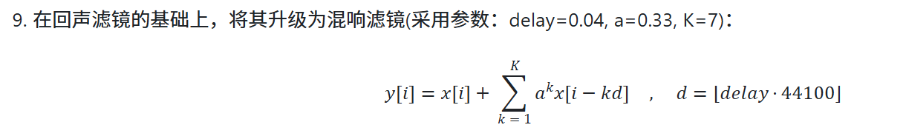
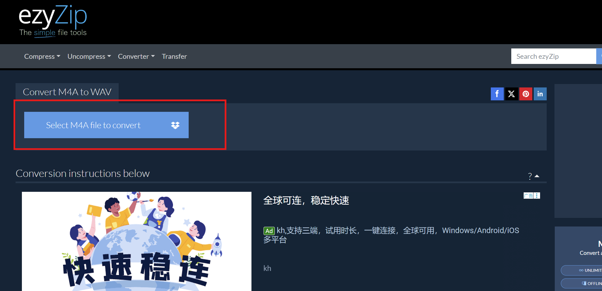
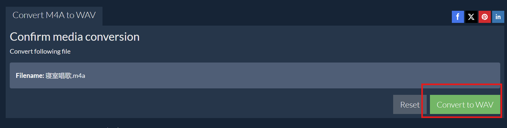
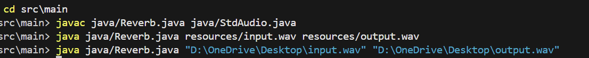
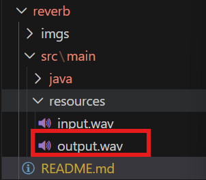

# 这是一个给.wav音频文件加混响滤镜的方法(基于Java)
- （由我的完成的Java作业启发，具体作业可见 [hw（可点击）](docs/hw.md)）
- 这是其中的第9题

##
###
#### 接下来就介绍：
#### 1. 怎么把一个.m4a文件（微信语音或手机录音）转换为.wav（波形音频文件格式）（我的这个程序只接受这种格式的文件）（为无损音质，可放心转化）；
#### 2. 给这个.wav文件加上混响音效；


# 正文：
## 1.把一个.m4a文件转换为.wav文件：
  借助 __ezyZip__(https://www.ezyzip.com/convert-m4a-to-wav-online.html)：一个值得推荐的在线工具，它在你的浏览器里就能完成转换，不需要把文件上传到服务器，对隐私保护更好。
  -  __ezyZip还可以转换任何一种格式，见(https://www.ezyzip.com/zh-hans.html)__  
- 1.点击Select M4A file to convert，并选择所要转换格式的.m4a音频文件:  


- 2.选好过后点击 convert to WAVE，并保存到电脑某个位置（我直接放到包的src\main\resources\input.wav）  


## 2.给这个.wav文件加上混响音效；
  直接利用该包的[Reverb.java程序（我利用第9题混响公式写的）](src/main/java/Reverb.java)，编译运行
  命令行格式为:  
   __cd src\main__<br>
   __javac java/Reverb.java java/StdAudio.java__<br>
   __java java/Reverb.java   [你要操作的文件的路径]   [你想要把加了混响的文件放到的地方]__<br>
- 比如对于我刚刚直接下载到`src/main/resources/input.wav`的文件[input.wav（可点击打开）](src/main/resources/input.wav)，命令行输入：  
   __cd src\main__  
   __javac java/Reverb.java java/StdAudio.java__  
   __java java/Reverb.java  src/main/resources/input.wav   src/main/resources/output.wav__  
   
   （这是两个例子，倒数第二行是放到包的resources里，最后一行是放到桌面）：
     
   就会得到`src/main/resources/output.wav`路径的[output.wav](src/main/resources/output.wav)文件，即为最终的混响音频  
     

## 改包的目录：
```
├─imgs
└─src
    └─main
        ├─java
        └─resources
```